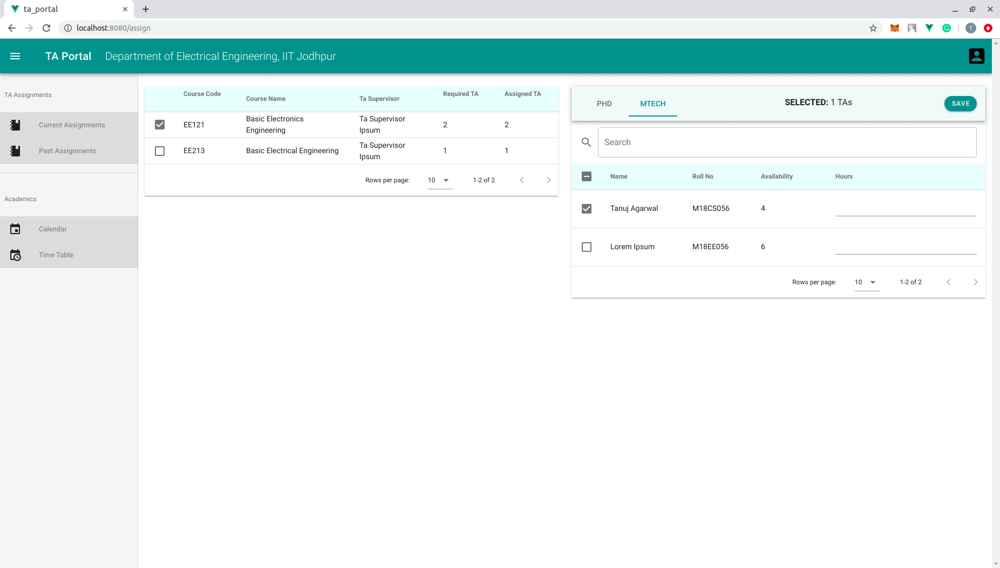
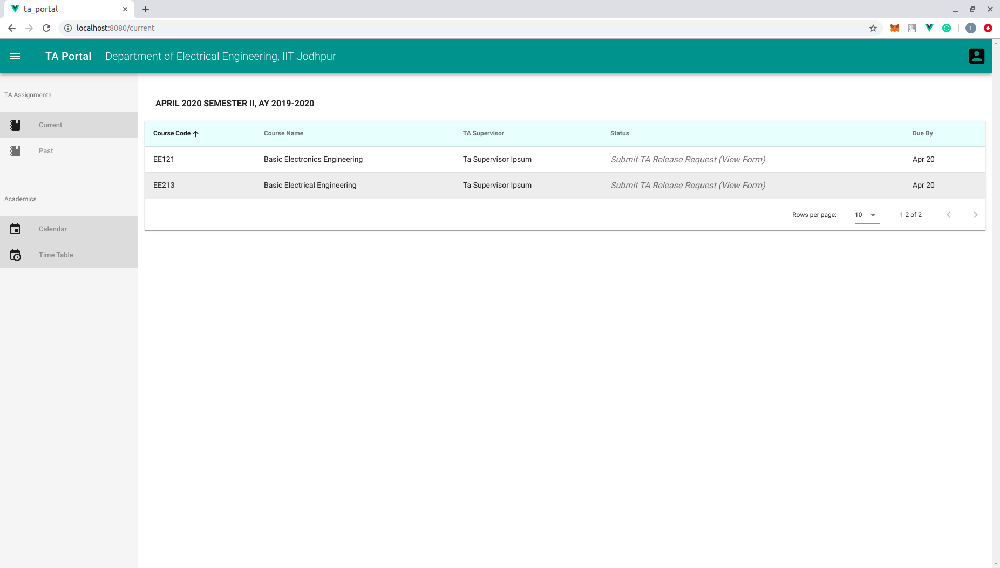
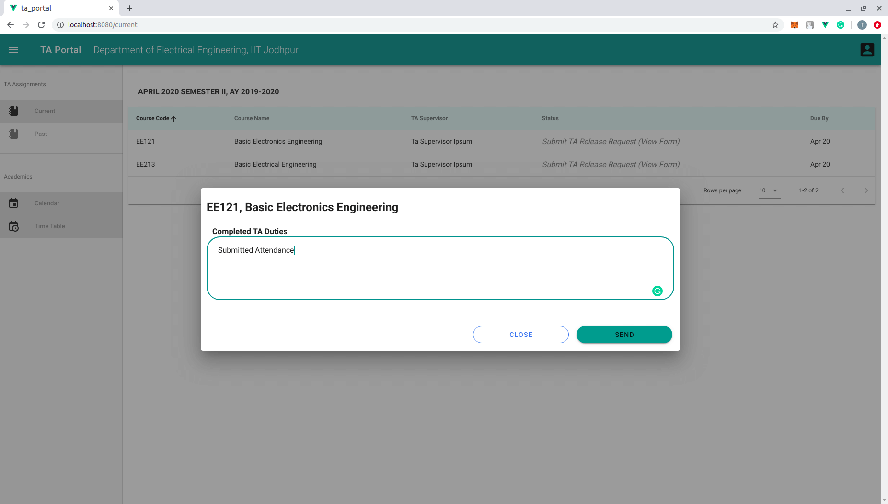
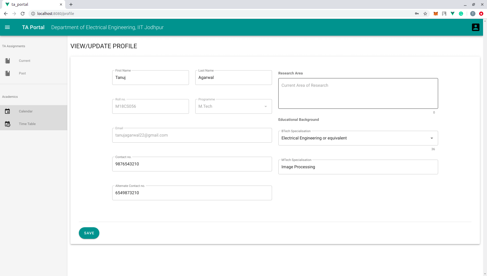
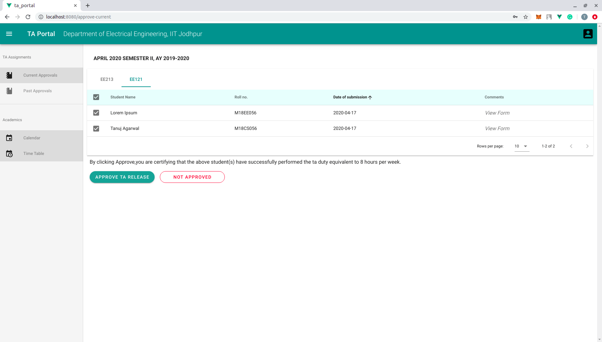
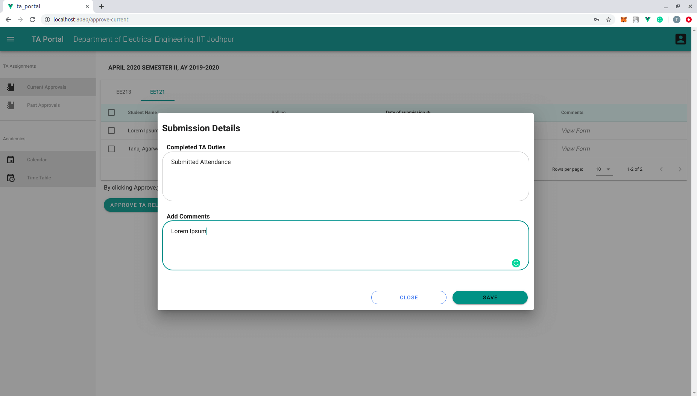
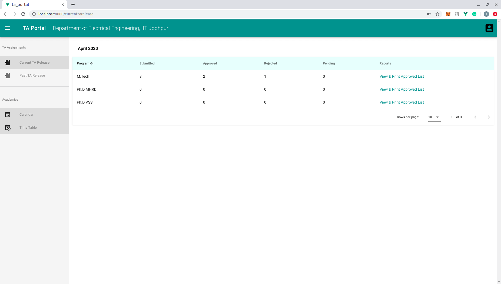
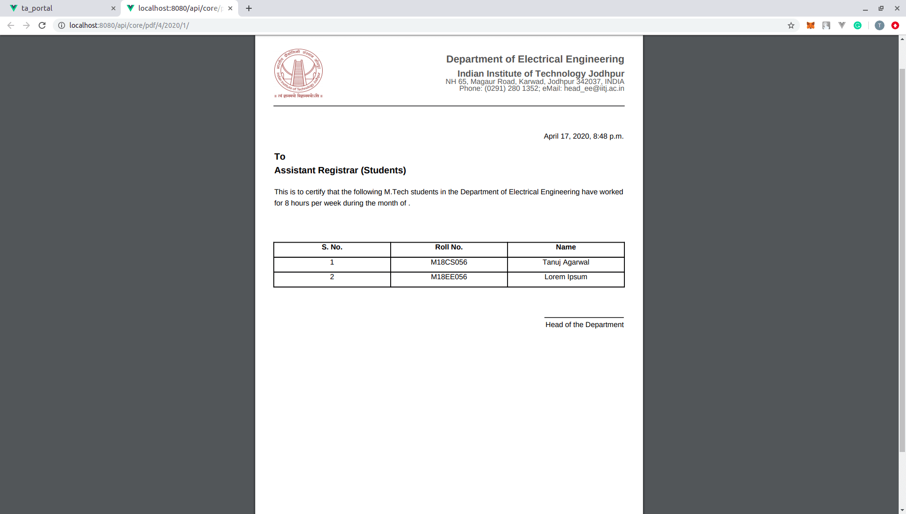

# ta_portal

## Purpose

A portal for Management of Teaching Assistants in IIT Jodhpur. This portal aims to simplify the process of assigning and coordinating Teaching Assistants.

### Workflow
The portal consists of **4 kinds** of users:

* **Teaching Assistant Coordinator -** Responsible for assigning TAs to courses based on the requirement of the course and availability of a TA.



* **Teaching Assistant -** Submits the work done by them each month in a course. They also maintain their profile to help TA Coordinator in assignment. 







* **Teaching Assistant Supervisor-** A TA Supervisor is the instructor for a course. He/She is responsible for approving/rejecting TA releases for his/her courses.
  


  

* **Office Staff-** Responsible for taking a printout of TAs which have completed a specified amount of TA duties.

  

  


## Getting Started

Ensure that you have installed [Docker](https://docs.docker.com/install/) (with [Docker Compose](https://docs.docker.com/compose/install/)).

Run the development server:
```
cd <project_directory_name>  # ta_portal
make dev-start
```

After executing `make dev-start`, you will be running:
* The application on http://localhost:8080 
* The API Server on http://localhost:8000

Make database migrations: 
```
make exec
python manage.py makemigrations
python manage.py migrate
```

Create a superuser: 
```
make exec
python manage.py createsuperuser
```

View logs of docker containers: 
```
make dev-logs
```

To stop the development server: 
```
make dev-stop
```